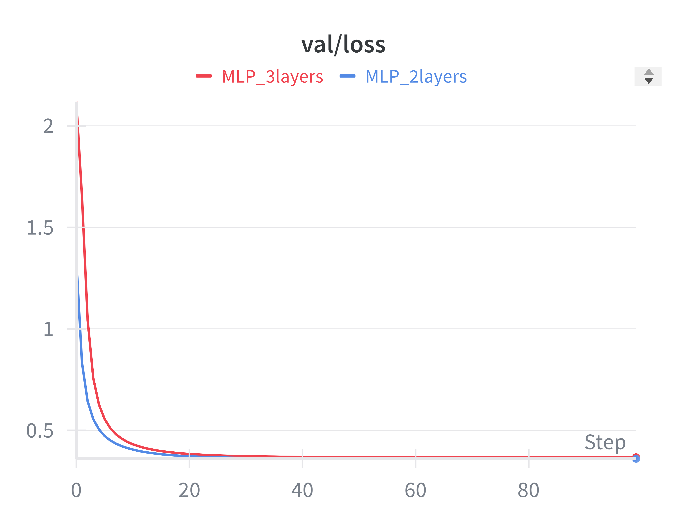

# Laboratory #1

## Overview
This laboratory aims to recreate on a small scale in PyTorch the results obtained in the paper that introduced ResNets, [Deep Residual Learning for Image Recognition](https://arxiv.org/abs/1512.03385) (Kaiming He, Xiangyu Zhang, Shaoqing Ren, Jian Sun, CVPR 2016), in order to demonstrate that these residual networks are easier to optimize and can gain accuracy from increased depth, compared to plain networks, addressing the degradation problem of the training error and the problem of vanishing/exploding gradients.

## Environment setup
    conda create -n dla2025 ipython pandas matplotlib seaborn scikit-learn jupyterlab ipywidgets

    conda activate dla2025

    pip install -r requirements.txt

## Data
The datasets used are MNIST (gray scale images of handwritten digits from 0 to 9), CIFAR10 (60000 RGB images categorized in 10 classes), both suitable for 10-class classification task, and CIFAR100 (60000 RGB images categorized in 100 classes), all available from `torchvision.datasets`.

## Code description
In [`config.py`](src/config.py) an `ArgumentParser` is employed to easily configurate in the command line the model optimization and evaluation parameters.

[`dataloader.py`](src/dataloader.py) provides utility functions to create train/validation/test DataLoaders for MNIST, CIFAR-10, and CIFAR-100 with configurable preprocessing, augmentation, and dataset splits.

[`models.py`](src/models.py) implements a collection of neural network models, ranging from classic Multi-Layer Perceptrons to more advanced architectures like Residual Networks and Convolutional Neural Networks, designed for image classification task.

* `MLP_2layers`: a basic MLP with two fully connected (linear) layers, featuring GeLU activation functions for enhanced performance;
* `MLP_3layers`: an extension of the basic MLP_2layers with an additional hidden layer;
* `DynamicMLP`: a flexible and adaptable MLP that can be instantiated with a variable number of hidden layers and custom sizes;
* `DynamicMLP_improved`: an enhanced version of the dynamic MLP that incorporates regularization techniques such as `BatchNorm1d` and `Dropout` to improve training stability;
* `ResidualMLP`: a MLP built with residual blocks, leveraging **skip connections** to facilitate the training of deeper networks;
* `DynamicResidualMLP`: a fully dynamic version of the Residual MLP, allowing for the creation of residual networks with a variable number of layers and a custom block structure;
* `myCNN`: a simple CNN architecture, featuring two convolutional layers followed by linear layers;
* `myCNN_improved`: an advanced CNN model that includes regularization techniques like `BatchNorm2d`, and `Dropout` at the linear layers level, along with a deeper convolutional backbone, for improved accuracy and robustness.
* `myMidCNN`: a CNN architecture, featuring five convolutional layers followed by three linear layers;
* `myDeepCNN`: a CNN architecture, featuring eight convolutional layers followed by four linear layers.

In [`trainer.py`](src/trainer.py) are defined the `trainer()` function to train and validate the models, logging on the `Weights & Biases` platform the running metrics of `train/loss`, `val/loss`, `val/accuracy`, `train/lr`, to visualize the evolution of their performances during the epochs; and the `trainer_ft()` function that adds to the previous a selective layer freezing option.

In [`tester.py`](src/tester.py) is defined the `tester()` function to test the models and to output the testing average loss and accuracy values, quantifying the correctness of the network predictions.

The [`main.py`](src/main.py) script serves as the primary entry point for training and evaluating various deep learning models on either the **MNIST** or **CIFAR-10** datasets, providing a modular workflow for selecting a model, setting up the data loaders, running the training and testing loops, and saving the results:

1. the script uses the [`config.py`](src/config.py) file to manage all hyperparameters and settings, including the model, dataset, learning rate, and batch size;
2. dynamically loads the specified model and dataset based on the configuration, supporting both custom-defined architectures and pre-trained models like ResNet18 and ResNet50;
3. it manages the complete machine learning workflow:
    * [`trainer.py`](src/trainer.py) that manages the training loop, including loss calculation, backpropagation, and logging;
    * [`tester.py`](src/tester.py) evaluates the final model on the test set;
4. tracks and plots key performance metrics such as training loss, validation loss, and validation accuracy over epochs;
5. the best-performing model (based on validation accuracy) is automatically saved in the [`/models`](./models/) folder, ensuring that the optimal weights are preserved for testing and possible later use.

Lastly, the [`comparison_MLP.py`](src/comparison_MLP.py.py) and [`comparison_res_MLP.py`](src/comparison_res_MLP.py.py) scripts provide a workflow, similar to the one in main.py, to train, validate and test the MLP and Residual MLP models iterating over different hidden layer sizes, in order to compare the performances of these architectures.

## Exercises

### Exercise 1.1 – A baseline MLP
> Implement a simple Multilayer Perceptron to classify the 10 digits of MNIST (e.g. two narrow layers). Implement your own training pipeline. Train this model to convergence, monitoring (at least) the loss and accuracy on the training and validation sets for every epoch.

To solve the instructions above, run the following prompts:

    python main.py --dataset mnist --model MLP_2layers --wandb_project LAB1

    python main.py --dataset mnist --model MLP_3layers --wandb_project LAB1

| Training Loss | Validation Loss | Validation Accuracy | 
|:-----------------:|:---------------------:|:---------------------:|
|  |  |  |

### Exercise 1.2 – Adding Residual Connections
> Implement a variant of your parameterized MLP network to support residual connections. Your network should be defined as a composition of residual MLP blocks that have one or more linear layers and add a skip connection from the block input to the output of the final linear layer. Verify that deeper networks with residual connections are easier to train than a network of the same depth without residual connections.

In order to visualize and compare the training/validation losses and test accuracies of the MLP (`DynamicMLP_improved()`) and Residual MLP (`DynamicResidualMLP()`) for a range of depths, run this command lines in two different splitted terminals (if you have multiple GPUs available), otherwise one at a time:

    python comparison_MLP.py --device cuda:0

    python comparison_res_MLP.py --device cuda:1

Then to be able to do the same with the basic `DynamicMLP()`, in the [`comparison_MLP.py`](src/comparison_MLP.py.py) file switch the comments in line [62-63] like so, and re-run the code:

    # model = DynamicMLP_improved(input_dim, hidden_sizes, num_classes).to(device)
    model = DynamicMLP(input_dim, hidden_sizes, num_classes).to(device)

| Training Loss | Validation Loss | Validation Accuracy | 
|:-----------------:|:---------------------:|:---------------------:|
|  |  |  |

|Model | Curve Name                         | Hidden Layers Size                | Test Accuracy |
|---|-------------------------------|-----------------------------------|:-------------:|
| `DynamicMLP()` | Dynamic_MLP_2layers        | [128, 64]                         | 0.8658        |
| `DynamicMLP()` | Dynamic_MLP_4layers         | [128, 64, 64, 32]                 | 0.0991        |
| `DynamicMLP()` | Dynamic_MLP_8layers        | [128, 128, 64, 64, 32, 32, 16, 16]| 0.1010        |
| `DynamicMLP_improved()` | Dynamic_improved_MLP_2layers| [128, 64]                         | 0.9204        |
| `DynamicMLP_improved()` | Dynamic_improved_MLP_4layers| [128, 64, 64, 32]                 | 0.9151        |
| `DynamicMLP_improved()` | Dynamic_improved_MLP_8layers| [128, 128, 64, 64, 32, 32, 16, 16]| 0.6887        |
| `DynamicResidualMLP()` | Residual_MLP_2layers        | [128, 64]                         | 0.9332        |
| `DynamicResidualMLP()` | Residual_MLP_4layers        | [128, 64, 64, 32]                 | **0.9416**    |
| `DynamicResidualMLP()` | Residual_MLP_8layers        | [128, 128, 64, 64, 32, 32, 16, 16]| 0.9313        |

The results clearly show that deeper networks without residual connections are very difficult to train. The plain `DynamicMLP()` models experience a dramatic drop in accuracy as the depth increases: while the 2-layer model achieves a reasonable accuracy (86%), both the 4-layer and 8-layer versions collapse to near-random performance (~10%).

The improved non-residual version `DynamicMLP_improved()` manages to achieve better results, with both the 2-layer and 4-layer networks performing well (>91%). However, the 8-layer version still suffers from a substantial degradation, reaching only an accuracy of 69%.

In contrast, the residual networks `DynamicResidualMLP()` are consistently easier to train, regardless of depth. Even at 8 layers, they maintain high accuracy (>93%), with the 4-layer residual model achieving the best overall result (94%). In this case, increasing depth does not lead to catastrophic failure, as seen in the plain MLPs.

These findings verify the claim that residual connections stabilize training and allow deeper architectures to perform reliably, whereas standard MLPs struggle to converge as depth increases.

### Exercise 1.3 – Rinse and Repeat (but with a CNN)
> Repeat the verification you did above, but with **Convolutional** Neural Networks and using CIFAR-10. Show that **deeper** CNNs *without* residual connections do not always work better and **even deeper** ones *with* residual connections. 

To solve the instructions above, run the following prompts:

    python main.py --dataset cifar10 --model myCNN --wandb_project LAB1

    python main.py --dataset cifar10 --model myCNN_improved --wandb_project LAB1

    python main.py --dataset cifar10 --model myMidCNN --wandb_project LAB1

    python main.py --dataset cifar10 --model myDeepCNN --wandb_project LAB1

    python main.py --dataset cifar10 --model ResNet18 --wandb_project LAB1

    python main.py --dataset cifar10 --model ResNet50 --wandb_project LAB1

| Training Loss | Validation Loss | Validation Accuracy | 
|:-----------------:|:---------------------:|:---------------------:|
|  |  |  |

| Model               | Test Accuracy |
|---------------------|:-------------:|
| `myCNN()`             | 0.1303            |
| `myCNN_improved()`    | 0.4131            |
| `myMidCNN()`             | 0.1000            |
| `myDeepCNN()`             | 0.1000            |
| `ResNet18(pretraining=True)` | 0.6745            |
| `ResNet50(pretraining=True)` | **0.7436**            |

The results confirm that increasing depth in CNNs without residual connections does not necessarily improve performance. The baseline `myCNN()` performs very poorly (13%), and while the improved version (`myCNN_improved()`) achieves a higher accuracy (41%), it still lags far behind the residual networks. The deeper versions `myMidCNN()` and `myDeepCNN()`'s accuracies indicate that the model is performing no better than random guessing.

By contrast, ResNet architectures with residual connections scale much better with depth: ResNet18 already reaches a solid accuracy of 67%, and the deeper ResNet50 performs even better at 74%.

This verifies that simply stacking layers in standard CNNs is not sufficient, whereas deeper residual CNNs train more effectively, do not suffer from training error degradation, and achieve higher performance on CIFAR-10.

-------

### Exercise 2.1 – *Fine-tune* a pre-trained model
> Train one of your residual CNN models from Exercise 1.3 on CIFAR-10. Then:
>1. Use the pre-trained model as a **feature extractor** (i.e. to extract the feature activations of the layer input into the classifier) on CIFAR-100. Use a **classical** approach (e.g. Linear SVM, K-Nearest Neighbor, or Bayesian Generative Classifier) from scikit-learn to establish a **stable baseline** performance on CIFAR-100 using the features extracted using your CNN.
>2. Fine-tune your CNN on the CIFAR-100 training set and compare with your stable baseline. Experiment with different strategies:
> * Unfreeze some of the earlier layers for fine-tuning.
> * Test different optimizers (Adam, SGD, etc.).

The goal of the implemented solution is to explore **transfer learning** by pre-training a custom ResNet18 model on CIFAR-10 and then fine-tuning it for image classification on CIFAR-100.

The project evaluates two different approaches and compares their performances against classical machine learning baselines.

The entire process is detailed in the [Lab1-CNNs.ipynb](Lab1-CNNs.ipynb) notebook and follows these key steps:

#### 1. Pre-training on CIFAR-10

A ResNet18 model is trained from scratch on the **CIFAR-10** dataset for 100 epochs using the Adam optimizer, achieving a final validation accuracy of **88.92%**, with the weights of the best-performing model saved for the next steps in [/models2/resnet18_cifar10.pth](./models2/resnet18_cifar10.pth).

#### 2. Feature Extraction & Baseline Performance

The pre-trained ResNet18 model is used as a **feature extractor** on the **CIFAR-100** dataset. The final classification layer is removed, and the output of the preceding layer (the feature vector) is extracted for every image in the CIFAR-100 training and test sets.

These features are then used to train and evaluate two classical Machine Learning models from `scikit-learn` to establish a performance baseline:
* **Linear SVM**: a Support Vector Machine with a linear kernel;
* **k-NN**: a k-Nearest Neighbors classifier with `n_neighbors=10`.

#### 3. Fine-Tuning on CIFAR-100

Two different fine-tuning strategies are implemented, trained and evaluated on CIFAR-100 leveraging the custom function `trainer_ft()` defined in [`trainer.py`](./src/trainer.py), saving both best validation models in [/models2](./models2/):

**Strategy 1: Train only the Classifier**

The weights of all convolutional layers are **frozen**. The original 10-class classification head (`fc` layer) is replaced with a new, randomly initialized one with 100 output classes, and only this new classifier is trained for 30 epochs using the Adam optimizer.

**Strategy 2: Train the Classifier and the Final Block**

The convolutional base is mostly frozen, except for the final residual block (`layer4`). The classification head is also in this case replaced with a 100-class layer, and both the new classifier and the parameters of `layer4` are trained for 30 epochs using the **SGD** optimizer.

#### Results

The final accuracies for all evaluated methods on the CIFAR-100 test set are summarized below.

| Method | Optimizer | Accuracy |
| --- | --- | :---: |
| Baseline (Linear SVM) | - | 34.51% |
| Baseline (k-NN) | - | 25.14% |
| Fine-Tuning (Classifier only) | Adam | 28.04% |
| **Fine-Tuning (Classifier + `layer4`)** | **SGD** | **39.04%** |

The results show that fine-tuning a pre-trained model can outperform classical ML methods:

-   The Linear SVM provided a baseline (34.51%) that outperforms the k-NN classifier and even the first fine-tuning strategy.
-   Simply training the classifier head with Adam **was not enough** to leverage the pre-trained features effectively, resulting in a lower accuracy (28.04%).
-   The most effective approach, achieving the highest accuracy of **39.04%**, was to **unfreeze the last convolutional block** (`layer4`) along with the classifier and train them using SGD, yet the result remains unsatisfactory.

More in-depth analyses could bring better metric values, hopefully resulting in a model that can adapt both its high-level feature representations and its final decision boundary to the new dataset.