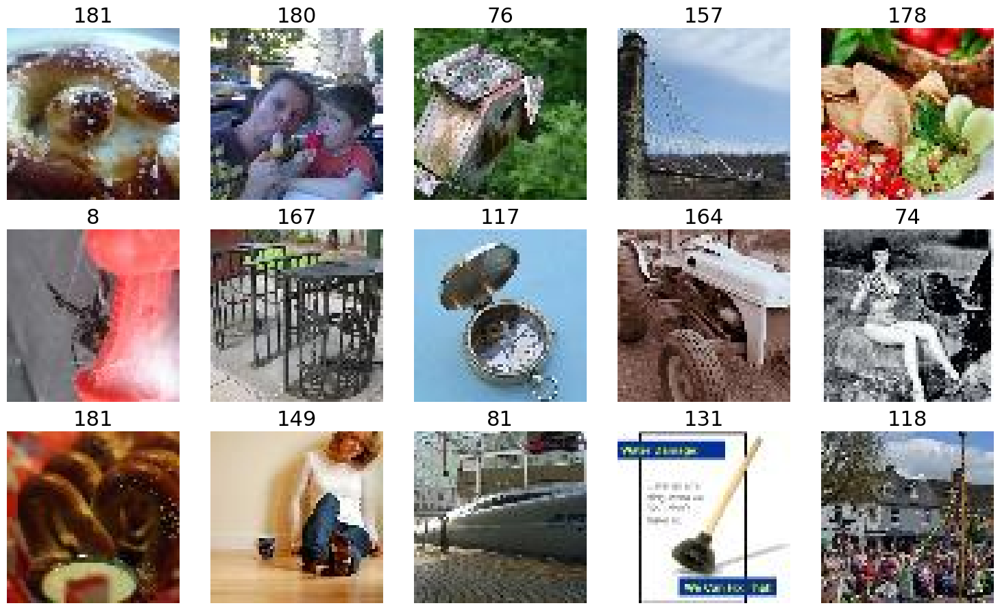
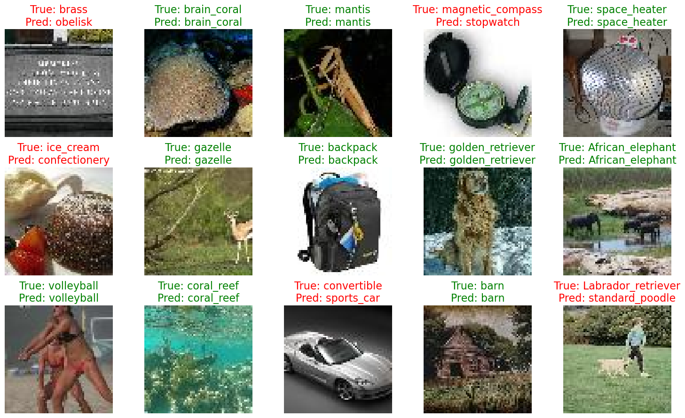

# Laboratory #3

## Overview
This repository contains a Jupyter Notebook ([Lab3-Transformers.ipynb](Lab3-Transformers.ipynb)) that demonstrates how to work with the HuggingFace ecosystem to adapt pre-trained **transformer** models for new tasks. The exercises cover **Sentiment Analysis** with DistilBERT and image **classification with CLIP**, including both feature extraction and parameter-efficient fine-tuning (PEFT) with LoRA.

## Environment setup
    conda create -n 'transformers' -c conda-forge transformers datasets matplotlib scikit-learn torchvision pytorch-gpu accelerate sentencepiece jupyterlab ipywidgets tqdm

    conda activate transformers

    pip install -r requirements.txt

## Code Structure
The exercise il solved entirely in the notebook [Lab3-Transformers.ipynb](Lab3-Transformers.ipynb), but some useful modules are implemented in the folder [/src](src/):
* [`CLIP_utils.py`](src/CLIP_utils.py) defines the `CLIPForClassification` class, a torch.nn.Module that adapts the pre-trained CLIP model for image classification;
* [`functions.py`](src/functions.py) contains helper functions for zero-shot classification, `zero_shot_classification()` a basic function that computes the zero-shot accuracy for a given dataset split, and `zero_shot_classification_with_plots()` a version that, in addition to calculating accuracy, generates and displays a plot of example images with their true and predicted labels, color-coded by correctness.

## Exercises
### Exercise 1.1 – Dataset Splits and Pre-trained model
> In this first exercise we will start from a pre-trained BERT transformer and build up a model able to perform text sentiment analysis. 

First, the Cornell Rotten Tomatoes movie review dataset is loaded using the HuggingFace datasets library, consisting of 5,331 positive and 5,331 negative processed sentences from the Rotten Tomatoes movie reviews, then splitted into three parts:

* Train set: 8530 examples
* Validation set: 1066 examples
* Test set: 1066 examples

The labels are binary: `1` for a positive review and `0` for a negative review.

Example of reviews:

    Index: 85
    Review text example: while the isle is both preposterous and thoroughly misogynistic , its vistas are incredibly beautiful to look at .
    Label example: 1
    
    Index: 5471
    Review text example: 'men in black ii creates a new threat for the mib , but recycles the same premise .
    Label example: 0

### Exercise 1.2 – A Pre-trained BERT and Tokenizer
> The model we will use is a *very* small BERT transformer called [Distilbert](https://huggingface.co/distilbert/distilbert-base-uncased).
> Load the Distilbert model and corresponding tokenizer. Use the tokenizer on a few samples from the dataset and pass the tokens through the model to see what outputs are provided.

    from transformers import AutoTokenizer, AutoModel

    tokenizer = AutoTokenizer.from_pretrained("distilbert/distilbert-base-uncased")

    model = AutoModel.from_pretrained("distilbert/distilbert-base-uncased")

### Exercise 1.3 – A Stable Baseline
> 1. Use Distilbert as a *feature extractor* to extract representations of the text strings from the dataset splits;
> 2. Train a classifier (your choice, by an SVM from Scikit-learn is an easy choice);
> 3. Evaluate performance on the validation and test splits.

To establish a performance baseline, we use DistilBERT as a feature extractor.

1. **Feature Extraction**: a feature-extraction pipeline is created, extracting for each sentence the embedding of the special `[CLS]` token from the last hidden layer, which serves as a representation of the entire sentence's meaning;

2. **Classifier Training**: these `[CLS]` embeddings are used as features to train a simple LinearSVC (Support Vector Classifier) from Scikit-learn;

3. **Evaluation**: the trained SVM is evaluated on the validation and test sets, resulting in the baseline performances of **82%** in validation accuracy and **80%** in test accuracy.

### Exercise 2.1 – Token Preprocessing
> Fine-tune the Distilbert model to (hopefully) improve sentiment analysis performance. The first thing we need to do is *tokenize* our dataset splits. Our current datasets return a dictionary with *strings*, but we want *input token ids* (i.e. the output of the tokenizer).

The `Dataset.map()` function applies the tokenizer to all splits of the dataset to efficiently preprocess the text and add `input_ids` and `attention_mask` columns, which are required for training with the `Trainer` API.

### Exercise 2.2 – Setting up the Model to be Fine-tuned
> In this exercise we need to prepare the base Distilbert model for fine-tuning for a *sequence classification task*. This means, at the very least, appending a new, randomly-initialized classification head connected to the `[CLS]` token of the last transformer layer.

`distilbert-base-uncased` is loaded with `AutoModelForSequenceClassification`, a class that automatically appends a randomly initialized classification head (a linear layer) on top of the pre-trained model, which will be trained for the specific task.

### Exercise 2.3 – Fine-tuning Distilbert
> Use a HuggingFace [`Trainer`](https://huggingface.co/docs/transformers/main/en/trainer) to fine-tune your model on the Rotten Tomatoes training split. 

The fine-tuning process is managed using the HuggingFace `Trainer`, as requested, with a setup that involves several key components:

* `DataCollatorWithPadding`: object responsible for creating batches of data by padding all sequences to the length of the longest sequence in each batch;

* `evaluate_metrics()`: function defined to compute evaluation metrics (accuracy and F1-score) from the model's predictions and true labels during evaluation;

* `TrainingArguments`: configures the training process;

The model is trained by calling trainer.train(), but stopped after 6 epochs (out of the 100 selected ones) due to the early stopping callback (to prevent overfitting).

Overall Results:

| Model | Validation Accuracy  | Validation F1-Score   |
|-------|----------------------|-----------------------|
| SVM baseline |   82%      |     80%       |
| **Fine-tuned DistilBERT**  | **85.46%**   | **85.45%**  |

This result shows an improvement of ~3.5% in accuracy on the validation set compared to the SVM baseline.

### Exercise 3.2 – Fine-tuning a CLIP Model
> Use a (small) CLIP model like [`openai/clip-vit-base-patch16`](https://huggingface.co/openai/clip-vit-base-patch16) and evaluate its zero-shot performance on a small image classification dataset like ImageNette or TinyImageNet. Fine-tune (using a parameter-efficient method!) the CLIP model to see how much improvement you can squeeze out of it.

The dataset chosen for the following experimentation is:

    dataset_id = "slegroux/tiny-imagenet-200-clean"

a streamlined, RGB-only version of Stanford’s Tiny ImageNet dataset, tailored for multi-class image classification tasks, consisting of colored images resized to 64×64 pixels spanning 200 classes and splitted in:
* Training: 98.2k images
* Validation: ~4.91k images
* Test: ~4.92k images 

The “clean” version specifically excludes grayscale images, maintaining only RGB samples.

*Some training examples from Tiny-ImageNet*

Before fine-tuning, we establish a zero-shot baseline. This involves using the pre-trained CLIP model to classify images without any task-specific training.

* **Preprocessing**: the dataset's WordNet ID labels (e.g., n02086240) are converted to human-readable names (e.g., goldfish) as CLIP is trained on natural language descriptions.

* **Zero-Shot Logic**: the `zero_shot_classification_with_plots()` function implements the classification and, for each image, it creates text prompts for all possible classes (e.g., "an image of a goldfish"), computes embeddings for both the image and all text prompts, calculates the cosine similarity between the image embedding and each text embedding, then the class corresponding to the highest similarity score is chosen as the prediction.

*Some Zero-shot classification results*

Baseline Results of Zero-shot Test Accuracy: **61.16%** 

Time to fine-tune the CLIP model with LoRA (Low-Rank Adaptation).

* **Model Setup**: a custom `CLIPForClassification` class is used to wrap the CLIP model and add a linear classification layer on top of the vision model's output embeddings;

* **LoRA Configuration**: use the `peft` library to apply LoRA; the configuration targets the `q_proj` and `v_proj` modules (query and value projection layers in the attention mechanism) of the vision transformer to significantly reduce the number of trainable parameters to just 983,040 (0.65% of the total).

* **Training**: the PEFT-enabled model is then fine-tuned for 3 epochs (due to computational costs involved) using the `Trainer` API.

|Fine-tuned Test Accuracy | 66.38% (+5.22% improvement)|
|--|--|
|Fine-tuned Test F1-Score| 64.76%|

The fine-tuned model shows a noticeable improvement over the zero-shot baseline, this demonstrates the effectiveness of LoRA in adapting large pre-trained models to specific tasks.

## References
[https://www.marqo.ai/course/fine-tuning-clip-models](https://www.marqo.ai/course/fine-tuning-clip-models)
