# Laboratory #4

## Overview
This repository contains the notebook [Lab4_OOD.ipynb](Lab4_OOD.ipynb), which explores two key concepts: **Out-of-Distribution (OOD) detection** and **Adversarial Training**, which goal is to implement a methodology for identifying samples that don't belong to the training data distribution and to create models that are more resilient to adversarial attacks.

## Environment setup
Work in the same _env_ created for LAB1.

    conda activate dla2025

    pip install -r requirements.txt

## Exercises

### Exercise 1.1 – Build a simple OOD detection pipeline

>Implement an OOD detection pipeline using an ID and an OOD dataset of your choice. Some options:
>+ CIFAR-10 (ID), Subset of CIFAR-100 (OOD).
>+ Labeled Faces in the Wild (ID), CIFAR-10 or FakeData (OOD). The LfW dataset is available in Scikit-learn (see `sklearn.datasets.fetch_lfw_people`).

The goal is to train a model on a known dataset and then test its ability to recognize inputs that are different from what it has seen during training. 

The In-Distribution source is CIFAR-10, while the Out-of-Distribution data random noise images are generated using `torchvision.datasets.FakeData`, like:

  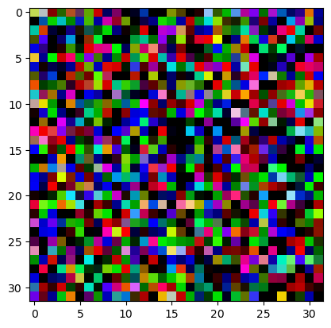

So, the ultimate intent is to develop a method that can discriminate CIFAR-10 images from random inputs using a model trained only on the real data. Two approaches were investigated.

#### 1. OOD Detection via classifier confidence:

The first detection strategy was based on the confidence score of a standard classifier. The idea is that a model should be highly confident when classifying an image from its training distribution (ID) and low confidence when presented with an unfamiliar OOD sample.

To test this a **CNN** was trained for 50 epochs on the CIFAR-10 dataset. Then, to measure its confidence on new images, the _maximum logit_ value from the model's final layer was used as a score. This method showed a separation between the score distributions for ID (test) and OOD (fake) data as we can observe from the histogram. 

Then this separation ability was quantitatively measured using the Area Under the Receiver Operating Characteristic (ROC) curve, achieving an AUC score of **0.91**.

| Max Logit Curve | Max Logit Histogram | Max Logit ROC|
|:--------:|:--------:|:--------:|
| 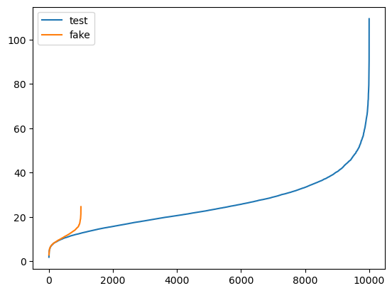 | 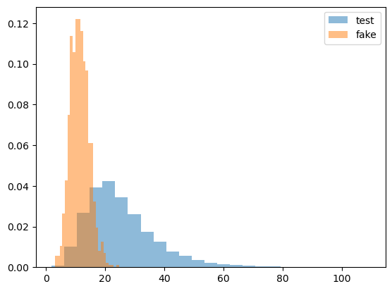 | 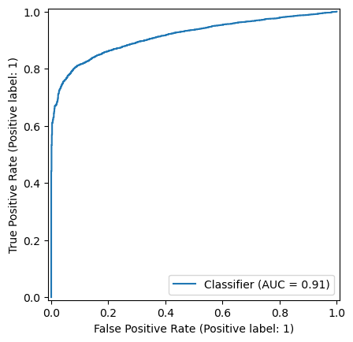 |

#### 2. OOD Detection via Reconstruction Error:

An alternative approach was also investigated using an **Autoencoder**'s reconstruction error (network trained to compress and then accurately reconstruct its input). The idea is that this network should be expert in reconstructing familiar CIFAR-10 images but struggle to reconstruct the random OOD images. The __Mean Squared Error_ (MSE)_ between an original image and its reconstruction was used as score. This method proved to work well, as the reconstruction errors for OOD samples were consistently higher than for ID samples.

This method obtained an AUC score of **0.94** .

| MSE Curve | MSE Histogram | MSE ROC|
|:--------:|:--------:|:--------:|
| 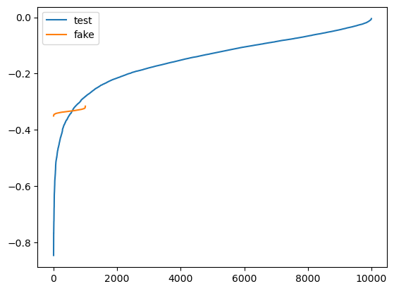 | 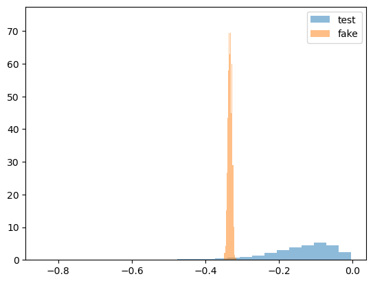 |  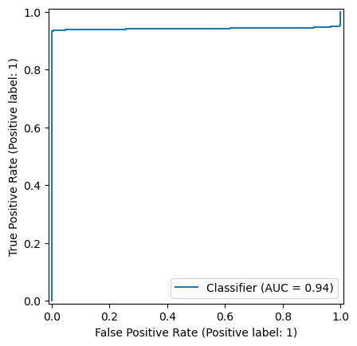 |

### Exercise 2.1 – Implement FGSM and generate adversarial examples 

The _Fast Gradient Sign Method_ operates by performing a single-step perturbation on the input image to make it slightly modified, designed to be misclassified by the model, while remaining visually indistinguishable from the original to the human eye. 

The core idea is to find the *direction* in the input space that will most increase the model's classification error. This direction is determined by calculating the *gradient* of the loss function with respect to the input image's pixels.

The attack then nudges each pixel in the direction indicated by the sign of its corresponding gradient. The magnitude of this _nudge_ is controlled by a small hyperparameter, epsilon ($\epsilon$), which represents the attack's _budget_ and ensures the perturbation remains subtle and difficult for a human to perceive.

$$ \boldsymbol{\eta}(\mathbf{x}) = \varepsilon \mathrm{sign}(\nabla_{\mathbf{x}} \mathcal{L}(\boldsymbol{\theta}, \mathbf{x}, y)) ) $$

1. The experiment began by selecting a correctly classified image by the CNN from the CIFAR-10 test set ("horse" in the following example).

2. The FGSM algorithm was applied to generate a perturbed, adversarial version of this image, visually nearly identical to the original.

| Original Image | Adversarial Image |
|:----------------:|:-----------------:|
| 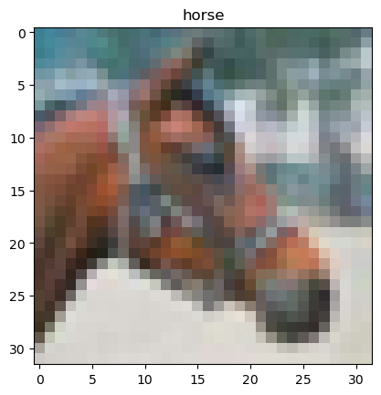  | 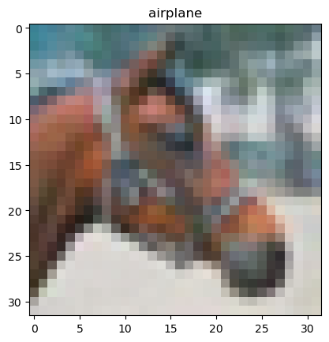  |

    Attack!!
    7 7
    0 7
    Untargeted attack success! budget:2/255

The untargeted attack was successful: the CNN, which had correctly classified the original image ("horse"- 7), confidently assigned the incorrect target label ("airplane"- 0) to the adversarial version. This outcome was achieved with a very small epsilon value ($\epsilon = \frac{2}{255}$), highlighting the model's sensitivity to input noise.

### Exercise 2.2: Augment training with adversarial examples

This task investigates the connection between deep learning models' Out-of-Distribution (OOD) detection and adversarial robustness. The main objective is to train a CNN using the CIFAR-10 dataset and then assess how retraining with adversarial instances affects the CNN's capacity to detect OOD samples.

The key experiments are:

1.  Training a standard CNN on CIFAR-10 and evaluating its baseline OOD detection performance against random FakeData.
2.  Implementing the Fast Gradient Sign Method (FGSM) to augment the training data "on the fly".
3.  Training a new "robust" model on this augmented dataset.
4.  Analyzing and explaining the significant change in OOD detection performance of the robust model.

To improve model robustness against adversarial attacks, the training process was augmented with _adversarially perturbed_ examples generated in real-time for each batch with the FGSM method and the corrisponding hyperparameter setted as $\epsilon =\frac{2}{255}$. This new trained model is referred as **Robust model**.

After training the robust model for 50 epochs, its OOD detection performance was evaluated using the _max_softmax_ and _max_logit_ confidence scores. The results showed a dramatic degradation in performance.

| Score |  Curve | Histogram |  ROC|
|-----------|:--------:|:--------:|:--------:|
|**Max Softmax**| 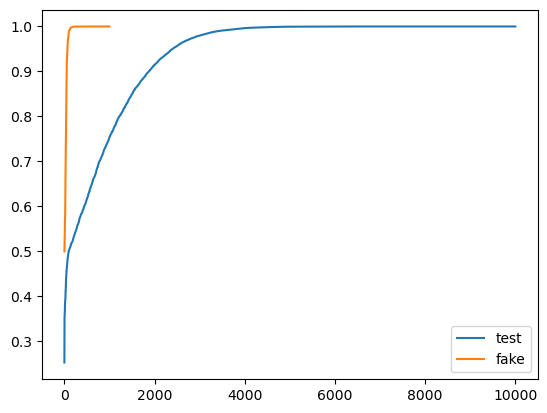 | 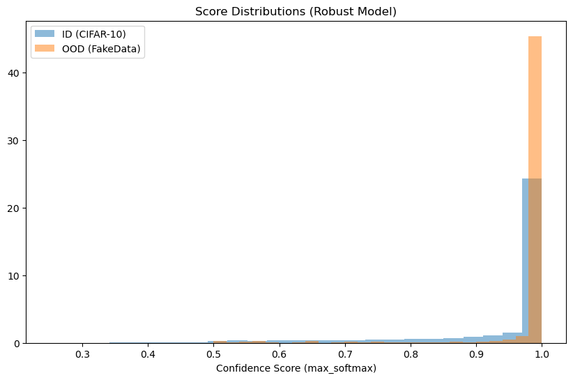 | 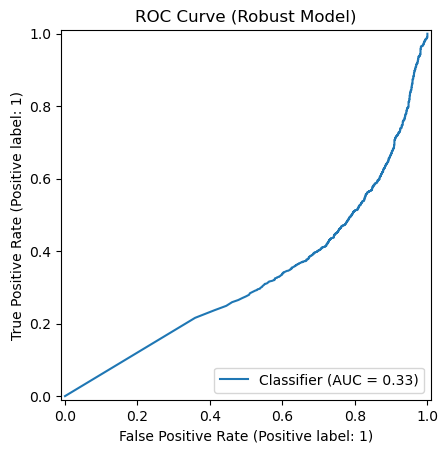 |
|**Max Logit**| 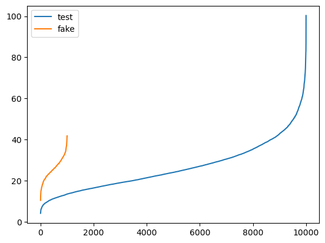 | 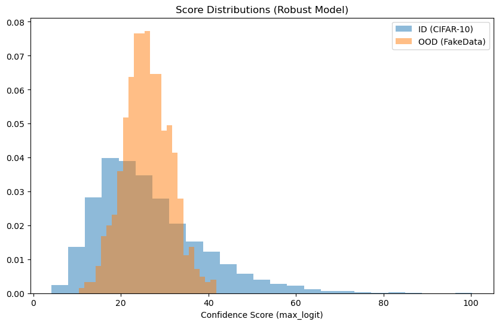 | 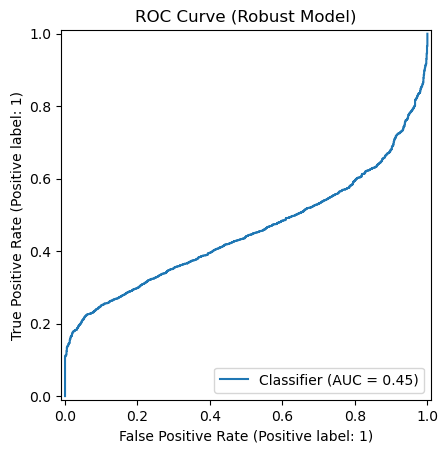 |

The histograms above clearly illustrate the problem. The distribution for OOD samples (orange, from FakeData) is shifted to the *right* of the distribution for ID samples (blue, from CIFAR-10), indicating that the adversarially trained model is now *more confident* about random noise than it is about the actual data it was trained to classify.

The adversarial training process is the reason for the decline in OOD performance: its goal is to strengthen a model so that it can reliably categorize a picture even in the presence of small disturbances, but when confronted with OOD data, which might be considered a severe disturbance, this taught "tenacity" has an unexpected side effect. The robust model misinterprets the noise as a simple perturbation, in contrast to a normal model that generates a low-confidence result for OOD inputs. This results in a high confidence score that essentially destroys the OOD sample's capacity to operate as an efficient OOD detector by confidently—but incorrectly—classifying it into one of its recognized categories. 

An important trade-off between *adversarial robustness* and *out-of-distribution detection* was brought to light by this experiment. A model's capacity to detect when an input is essentially different from its training data might be seriously harmed by the same mechanism that makes it resilient to minor perturbations.

### Exercise 3.3 - Targeted Adversarial Attacks with FGSM

In _targeted_ attacks, instead of perturbing the input image to maximize the loss with respect to its true label, the attack is to **minimize** the loss with respect to the desired target label. This is achieved by moving the input image's pixels in the opposite direction of the gradient sign, effectively performing a one-step gradient descent towards the target class.

$$x_{\text{adversarial}} = x - \epsilon \cdot \text{sign}(\nabla_{x} J(\theta, x, y_{\text{target}}))$$

$$\epsilon=\frac{1}{255}$$

An image from the CIFAR-10 test set, initially classified correctly by the model, was selected as the victim ("truck" in the following example). The _targeted_ attack was then executed with the goal of forcing a misclassification to a different, chosen class (making the model see a "deer" instead of a "truck").

Qualitatively, the generated adversarial image remained visually identical to the original, with the perturbation being an human imperceptible layer of noise. 

The attack successfully fooled the model: the network, which was previously confident in the correct label, incorrectly classified the perturbed image as the specific target class.

| Original Image | Adversarial Image |
|:----------------:|:-----------------:|
| 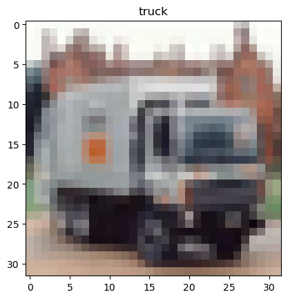  | 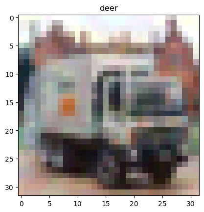  |

    Attack!!
    target: deer
    9 9
    9 9
    9 9
    9 9
    Clipping input data to the valid range for imshow with RGB data ([0..1] for floats or [0..255] for integers). Got range [0.04117636..1.0411773].
    9 9
    1 9
    1 9
    1 9
    1 9
    1 9
    1 9
    1 9
    1 9
    1 9
    1 9
    1 9
    1 9
    7 9
    7 9
    7 9
    4 9
    Targeted attack(deer) success! budget:21/255

| Score |  Curve | Histogram |  ROC|
|-----------|:--------:|:--------:|:--------:|
|**Max Softmax**| 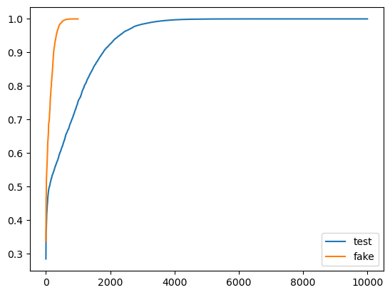 | 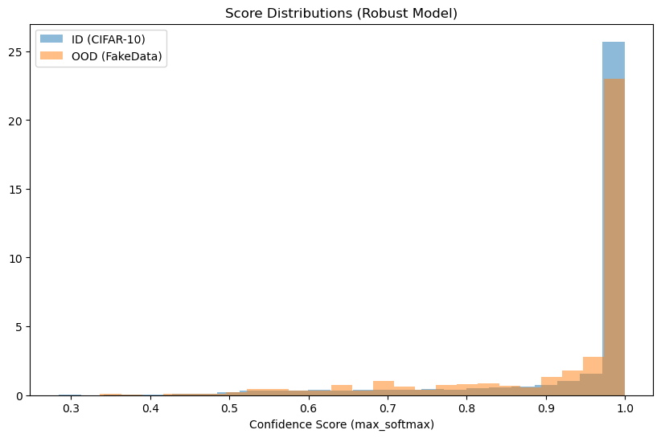 | 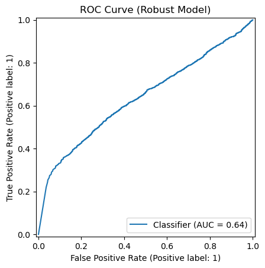 |
|**Max Logit**| 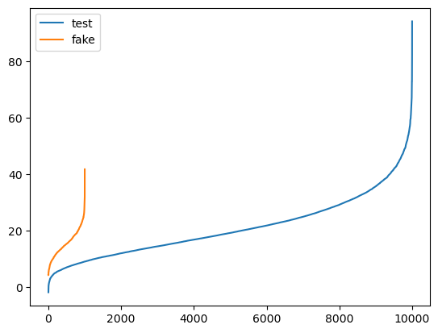 | 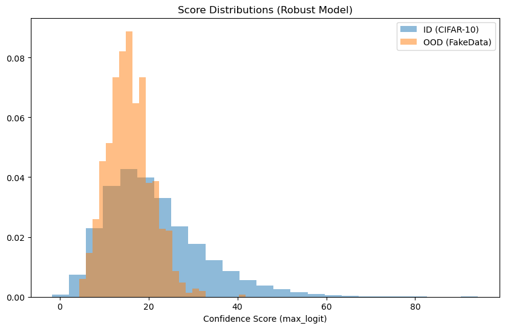 | 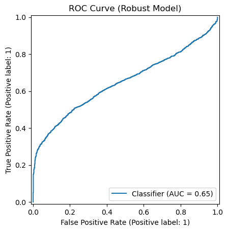 |

#### Other targeted attack examples:

| Original Image | Adversarial Image |
|:----------------:|:-----------------:|
| 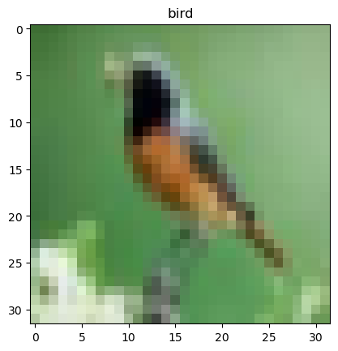  |   |

    Attack!!
    target: deer
    2 2
    2 2
    2 2
    2 2
    Clipping input data to the valid range for imshow with RGB data ([0..1] for floats or [0..255] for integers). Got range [-0.011765006..0.98431385].
    2 2
    2 2
    5 2
    4 2
    Targeted attack(deer) success! budget:8/255

| Original Image | Adversarial Image |
|:----------------:|:-----------------:|
| 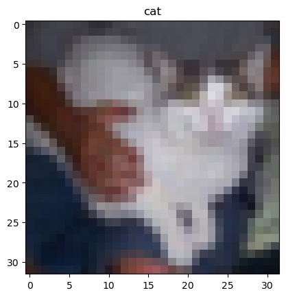  | 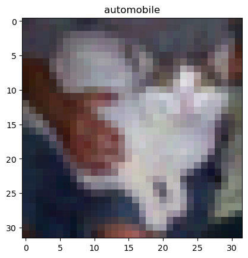  |

    Attack!!
    target: automobile
    3 3
    3 3
    3 3
    3 3
    3 3
    5 3
    5 3
    5 3
    5 3
    1 3
    Targeted attack(automobile) success! budget:10/255